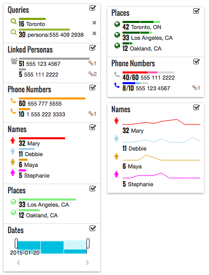
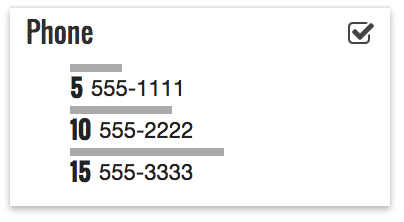

# Facets

> A Javascript UI component for interactive histograms

Facets provides a simple API for displaying histograms that are interactive. Facets is useful for quickly showing the results of Elasticsearch aggregations.

## Usage

    var container = $('#facets-container');
    
    var groups = [{
        label: 'Phone',
        key: 'phone',
        facets : [{
            value: '555-1111',
            count: 5
        }, {
            value: '555-2222',
            count: 10
        }, {
            value: '555-3333',
            count: 15
        }]
    }];
    
    var facets = new Facets(container,groups);
    

A full list of interactive examples can be [found here](./examples) 

    

## Installation

The Facets Widget is available via [NPM](https://www.npmjs.com/package/uncharted-facets).

To use it as a JSPM dependency, first install JSPM:

	npm install -g jspm

Now you can install it in your project:

	jspm install npm:uncharted-facets

To consume it in your project, use:

    import Facets from 'uncharted-facets';

## Development

Requires Node/NPM and a global installation of Gulp for running builds.

To install all dependencies and start a Gulp watch:

	npm install
	gulp

### Using the development version

Facets auto-links via JSPM on build/watch. This means you can use your local linked copy in other projects for quick iteration. To do so, run the following in your project that requires Facets:

    jspm install --link npm:uncharted-facets

This will connect that project to your local development version of facets. Be aware that this is version sensitive so if your local version of facets doesn't match the version being consumed by your project this may not have the desired effect.

To unlink the project and go back to the version from npm, run:

    jspm install --unlink npm:uncharted-facets

## Run tests

In development mode, run `gulp tdd --debug` to run the tests in Chrome, and keep the browser open, re-running on changes.

To run the tests once and generate a coverage report, run `gulp test`.
